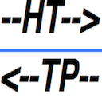
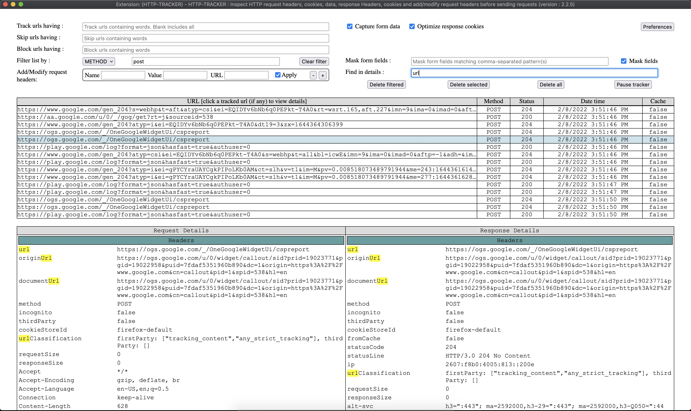

#  HTTP-TRACKER

**A powerful browser extension that brings your network traffic into one central place — across all tabs, all windows, even incognito.**

---

## 🚀 What is HTTP-TRACKER?

HTTP-TRACKER is a browser extension that tracks all network activity in your browser — Chrome and Firefox. Everything you can see in the browser's built-in Network tab, and more, is available through this extension in a **single centralized window**.

Unlike the built-in DevTools, HTTP-TRACKER aggregates requests from **all open tabs** and **all windows** — including private/incognito tabs (when permission is granted) — giving you a unified view of everything your browser is doing on the network.

---

## ✨ Features

### 🔍 Network Tracking

- 📡 Tracks **all HTTP/HTTPS requests** across all tabs and windows in real time
- 🕵️ Supports **private/incognito window** tracking when permission is enabled
- ⚡ Fully **async and non-blocking** — zero added latency to your actual requests

### 🎯 Filtering & Pattern Matching

- ✅ **Include filter** — set patterns so only matching URLs are tracked (`Track URLs having`)
- 🚫 **Exclude filter** — skip URLs containing specific patterns (`Skip URLs having`)
- 🔒 **Block URLs** — simulate ad-block or 404 behavior for specific URL patterns
- 🔎 Filter captured requests by **URL, method, status, date, cache**
- 🔗 Use `&` (AND) and `|` (OR) operators for advanced filter expressions

### 💾 Persistent Preferences

- 🌍 Set **global exclude/include/block/mask patterns** via the options page
- 🔄 Patterns persist across extension restarts — no repetitive re-entry

### 🛠️ Request Header Injection

- ➕ **Add or modify request headers** on the fly without leaving the browser
- 🌐 Apply headers globally (all URLs) or scoped to a specific URL pattern
- ⚠️ Automatically validates against forbidden headers with a visual red-border indicator
- ✔️ Use the **Apply** checkbox to control exactly when a header is activated

### 🛡️ Privacy & Security

- 🎭 **Mask sensitive data** — shows only the first and last character, replacing the rest with `*****`
- 📋 Perfect for sharing screenshots without exposing credentials or tokens

### 🍪 Cookie Management

- 🔤 Displays request cookies **sorted** (symbols first, then 0–9, then Aa–Zz case-insensitive)
- 🧹 **Optimize response cookies** — resolves the final value when duplicate cookies exist

### 🔦 Find in Details

- 🔎 Search across all header keys, values, cookies, and body of the **selected request** using the Find field
- 🟡 Matches are **highlighted inline** using `<mark>` so you can spot values instantly without scrolling
- Supports **regular expressions** — e.g. `token.*value` to match patterns across header content
- Case-insensitive and matches **all occurrences** simultaneously

### 🖱️ UX Controls

- ⏸️ **Pause tracking** without closing the extension — hold data for reference
- 🗑️ Delete all captured data, selected pairs, or all filtered results
- 📋 Captures **form data** in requests (when the option is enabled)

---

## ⌨️ Keyboard Shortcuts

| Platform   | Shortcut           |
| ---------- | ------------------ |
| 🍎 macOS   | `CMD + SHIFT + 1`  |
| 🪟 Windows | `CTRL + SHIFT + 1` |

---

## 📸 Screenshot

---

## 📦 Installation

### Chrome

### Firefox

---

## 📄 License

This project is licensed under the [MIT License](LICENSE).

---

Made with ❤️ for developers who live in the network tab.

⭐ If you find this useful, please star the repo and leave a review!

