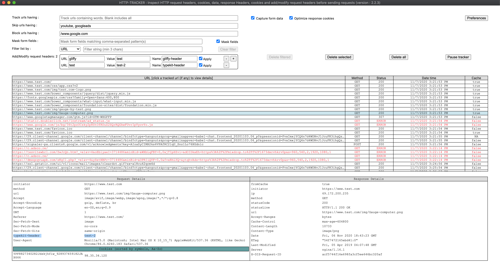

HTTP-TRACKER

  

# What is HTTP-TRACKER?

HTTP-TRACKER is a browser extension which tracks the network on the browser (chrome and firefox). What ever is captured on the network tab in a browser, the same and more can be done by this extension. This provides a centralized window which displays the entire requests - responses from all the tabs and windows of the browser. This can also track the private/incognito window tabs (if permission is enabled), bringing everything into a central place.
  

# Features

* Easily activate/open the extension with a shortcut
	* CMD+SHIFT+1 - MAC

	* CTRL+SHIFT+1 - WINDOWS

* Set patterns to only track those requests with contain the patterns so that the addon will only track those matching urls.
	* Use field "Track urls having". Leaving this field blank will track all the urls. This field takes a comma separated list of patterns. If this filed is not empty, then only urls matching these patterns will be tracked

* Set patterns to exclude certains urls containing these patterns
	* Use field "Skip urls having". Leaving this field blank will not skip any url. This field takes a comma separated list of patterns. If this filed is not empty, then only urls matching these patterns will be skipped.

	* If same pattern is in both "Track urls having" and "Skip urls having" fileds, then the url will be skipped

* Set global exclude patterns via preferences option so that these persist across extension/browser restarts, there by avoiding repetitive entry of exclude urls

* Block certain urls having a specific text without leaving the browser, like simulating adblock or a page not found behavior, which helps users to identify how a site / page works when certain urls does not load.
	* Use field "Block urls having" to add a comma seperated list of patterns to block urls.

* Mask i.e. display the first and last character masking the rest of data with ***** - providing extra layer of security when sharing screenshots of the content

* Add / modify request headers on the fly
	* If the url filed is empty, the headder is added to all outgoing requests. If it is not empty, the header will be added to all the urls matching the content of this URL field.

	* Name : Can be any non-empty string, except forbidden headers. If the header name is invalid, a red border appears around the entire header to give a visualization of error, and these error headers are not added to the requests.

	* Apply checkbox: Check this only after the header name is added completely, otherwise if the browser is sending requests, while typing the name, the addon adds the header as you type. To avoid this confusion, always check the apply button after adding the complete header name

* Filter the captured list of urls based on
	* url pattern
	* method (GET, PUT, POST, etc)
	* status
	* date
	* cache

* Captures form data in the request - if the option is enabled

* Always displays sorted request cookies with symbols first, and Aa - Zz next i.e alphabetically ignoring case

* Optimize response cookies to ease the life of the user by resolving the final value of cookies when duplicate cookies exist in the response - user has to enable this option

* Pause the http-tracker without closing the extension when capturing of required data is done to hold the data for reference

* Delete all the entire captured data

* Delete selected request - response pair

* Delete all the filtered data

* Very fast, and works async without causing any additional delay to the actual request-response

# Install

* firefox: https://addons.mozilla.org/en-US/firefox/addon/http-tracker/

* chrome: https://chrome.google.com/webstore/detail/http-tracker/fklakbbaaknbgcedidhblbnhclijnhbi?hl=en&authuser=0